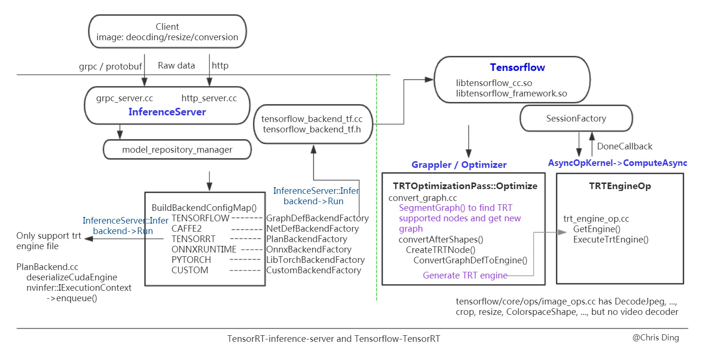

# Using TF-TRT C++ API 

* [mnist_tf](./mnist_tf) is mnist without tensorRT..
* [mnist_tftrt](./mnist_tftrt) is mnist with tensorRT..
* [ssd](./ssd) is with tensorRT



Verified with:
1. TensorFlow 2.0
2. TensorRT 5.1, cuda 10.1, cudnn 7.5

See more INFO TF logs, 
```
export TF_CPP_MIN_VLOG_LEVEL=2
```
